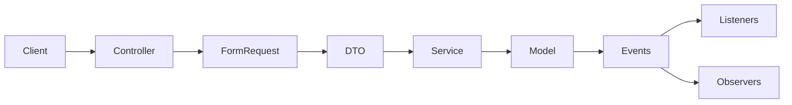

# SupportFlow

*[Русская версия](README.ru.md)*

SupportFlow is a ServiceDesk/helpdesk backend built with Laravel. It handles the full ticket lifecycle (create, assign, reprioritize, comment, close, reopen), tracks SLA response and resolution deadlines with automatic breach detection, indexes tickets in Elasticsearch for full-text search, and keeps a field-level audit trail of who changed what on sensitive records. A Filament admin panel sits on top for staff who'd rather not use the API directly.

## Tech stack

- **PHP 8.3+**, **Laravel 13**
- **PostgreSQL 15+** as the database
- **Filament 5.9** for the admin panel
- **Elasticsearch 8.x** for ticket search
- **MinIO** (or any S3-compatible store) for ticket attachments
- **Laravel Sanctum** for API token authentication
- **Spatie Laravel Permission** for roles and permissions
- **OpenAPI 3.0.3** for the API contract (`openapi.yaml`)
- **Pest** for testing, run against a real Postgres database rather than an in-memory one
- **Docker Compose** for local Postgres, MinIO, and Elasticsearch

## Key engineering decisions

**Search never bypasses authorization.** Elasticsearch only decides which ticket IDs match a query and in what order. The actual result set still goes through `Ticket::visibleTo($user)`, the same scope every other ticket query uses, applied as a database filter after the Elasticsearch lookup. A stale or tampered search index can narrow what a user sees, never widen it. This is covered by a dedicated test that feeds a fake search client an ID the acting user has no permission to see and asserts it never reaches the response.

**Elasticsearch being down doesn't take ticket management down with it.** Indexing runs in a queued job that catches Elasticsearch's own exception types and logs a warning instead of failing the request. The search endpoint does the same, returning an empty result instead of a 500. A `tickets:reindex-search` command catches up anything missed while Elasticsearch was unreachable.

**The audit trail is one Observer, not five.** `Ticket`, `TicketComment`, `TicketAttachment`, `User`, and `SlaPolicy` all pull in the same `HasAuditLog` trait, which registers a single shared `AuditObserver` on each. The Observer diffs Eloquent's own `getChanges()`/`getPrevious()` rather than hand-rolling comparisons, so every audited model gets identical, tested diffing logic for free. Registration is deferred via `whenBooted()` rather than called directly from the trait's boot method, which avoids a model-boot reentrancy exception in this Laravel version.

**One permission model, enforced consistently.** A single Sanctum guard backs the API while Filament runs on the `web` guard, and Laravel's guard resolution can mutate the active guard mid-request depending on which middleware last ran. The `User` model pins its Spatie guard name explicitly rather than trusting the default, so role and permission checks resolve the same way regardless of which guard authenticated the request.

**Administrators bypass every Policy through one Gate, and sensitive Policies deny by default rather than by omission.** `AppServiceProvider` grants administrators blanket access via `Gate::before`. Policies that should be off-limits to everyone else, like the audit log's, return `false` explicitly from every method instead of leaving them unimplemented, so there's no ambiguity about what an absent Policy method defaults to.

## Project structure



- `app/Http/Controllers/Api`: REST API controllers, thin, delegate to services
- `app/Http/Requests/Api`: FormRequests: validation and authorization per endpoint
- `app/DataTransferObjects`: typed DTOs passed from requests into services
- `app/Services`: business logic (ticket operations, SLA calculation, search)
- `app/Models`: Eloquent models
- `app/Events`, `app/Listeners`, `app/Observers`: domain events and their side effects (notifications, SLA recalculation, search indexing, auditing)
- `app/Policies`: authorization rules, one per model
- `app/Filament`: admin panel resources, tables, forms, and dashboard widgets
- `app/Jobs`: queued background work (attachment scanning, search indexing)
- `app/Console/Commands`: scheduled and manual Artisan commands
- `database/migrations`, `database/factories`, `database/seeders`
- `routes/api.php`: API route definitions
- `tests/Feature`: the whole test suite, feature-level, against a real database
- `openapi.yaml`: the API contract

## How to run

The app needs Postgres, MinIO, and Elasticsearch running alongside it. `docker-compose.yml` in the repo root starts all three with the credentials `.env.example` already expects:

```bash
docker compose up -d
composer install
cp .env.example .env
php artisan key:generate
php artisan migrate --seed
```

The seeder creates demo roles, permissions, a pool of customers, and sample tickets, and queues them all for indexing in Elasticsearch. `test@example.com` / `password` is seeded as an administrator, so you can log into both the API and the admin panel with it right away. See `database/seeders` for the rest.

### PostgreSQL

`.env.example` is already configured for the `postgres` service in `docker-compose.yml`:

```
DB_CONNECTION=pgsql
DB_HOST=127.0.0.1
DB_PORT=5432
DB_DATABASE=supportflow
DB_USERNAME=supportflow
DB_PASSWORD=supportflow-dev-secret
```

That container also creates a separate `supportflow_testing` database on first boot (see `docker/postgres/init-testing-db.sh`), which is what `phpunit.xml` points the test suite at. Tests run against a real Postgres database, not an in-memory one, so `docker compose up -d postgres` needs to be running before you run the suite too.

### MinIO (attachments)

Ticket attachments are stored in an S3-compatible bucket. `.env.example` is already configured for the `minio` service in `docker-compose.yml`. The bucket itself still needs creating once, after the container is up:

```bash
mc alias set supportflow-local http://localhost:9000 supportflow supportflow-dev-secret
mc mb supportflow-local/supportflow-attachments
```

The MinIO console is then available at `http://localhost:9001` (login with the root user/password from `.env.example`).

### Elasticsearch (search)

Ticket search is backed by Elasticsearch. `.env.example` is already configured for the `elasticsearch` service in `docker-compose.yml`. The `tickets` index gets created automatically the first time a ticket is indexed, there's no separate migration step. If Elasticsearch is down or unreachable, ticket create/update/delete still work as normal, and search just returns no results rather than failing (see "Key engineering decisions" above). Once Elasticsearch is back, run `php artisan tickets:reindex-search` to catch up anything that was missed while it was down.

## Environment variables and secrets

None of these are real secrets, they're local development defaults that match `.env.example` and `docker-compose.yml`. For a real deployment, replace every one of them.

| Variable | Purpose |
|---|---|
| `DB_*` | Postgres connection (host, port, database, username, password) |
| `AWS_ACCESS_KEY_ID`, `AWS_SECRET_ACCESS_KEY` | MinIO/S3 credentials for attachment storage |
| `AWS_BUCKET`, `AWS_ENDPOINT` | Which bucket and endpoint to store attachments in |
| `ELASTICSEARCH_HOSTS` | Elasticsearch node URL(s) |
| `ELASTICSEARCH_TICKET_INDEX` | Index name for ticket documents |
| `APP_KEY` | Laravel's encryption key, generate your own with `php artisan key:generate` |

## API documentation

All endpoints live under `/api/v1` and (aside from issuing a token) require an `Authorization: Bearer <token>` header. The full contract, every endpoint, request and response shape, and error format, is described in [`openapi.yaml`](openapi.yaml). Open it in [Swagger Editor](https://editor.swagger.io/) or any OpenAPI-compatible viewer to browse it.

Resource groups:

- `tickets`: CRUD, plus `assign`/`close`/`reopen`/`priority` actions and a `search` endpoint (`GET /tickets/search?q=...`)
- `tickets/{ticket}/comments`, `tickets/{ticket}/attachments`, `tickets/{ticket}/watchers`, `tickets/{ticket}/tags`
- `saved-filters`: per-user saved ticket-list filters
- `departments`, `teams`, `ticket-categories`, `tags`, `sla-policies`: admin-managed catalog resources

Authenticate with email and password to get a token, then use it as a bearer token:

```bash
curl -X POST http://localhost:8000/api/v1/auth/tokens \
  -H "Content-Type: application/json" \
  -H "Accept: application/json" \
  -d '{"email": "test@example.com", "password": "password"}'
# => { "data": { "token": "1|xxxxxxxxxxxxxxxxxxxxxxxxxxxxxxxxxxxxxxxx" } }

curl http://localhost:8000/api/v1/tickets \
  -H "Authorization: Bearer 1|xxxxxxxxxxxxxxxxxxxxxxxxxxxxxxxxxxxxxxxx" \
  -H "Accept: application/json"
```

Revoke the current token with `DELETE /api/v1/auth/tokens/current`.

## Database migrations

```bash
php artisan migrate
```

Fresh install: `php artisan migrate --seed` (see "How to run" above). To roll back and reseed from scratch: `php artisan migrate:fresh --seed`.

## Tests

Needs the Postgres container running (`docker compose up -d postgres`), since the suite runs against a real `supportflow_testing` database rather than an in-memory one.

```bash
php artisan test
# or
vendor/bin/pest
```

The suite is feature-level throughout: real database, real factories, no mocked business logic. The one place a test double appears is the Elasticsearch client boundary, for a test that specifically verifies a stale search result gets filtered out by authorization (see "Key engineering decisions" above).

## Demo

Not deployed anywhere. It's a portfolio project meant to be run locally following "How to run" above; the seeder gives you a populated database (40 tickets, agents, customers, categories) to explore immediately.

## Limitations

- The audit log only records `updated` events, not `created` or `deleted`, and only for `Ticket`, `TicketComment`, `TicketAttachment`, `User`, and `SlaPolicy`. It doesn't track many-to-many relationship changes (a ticket gaining a tag or a watcher doesn't fire the ticket's own `updated` event). There's no retention or pruning policy, rows accumulate indefinitely.
- Audit log access is administrator-only via the `Gate::before` bypass; there's no dedicated granular permission for it.
- Elasticsearch search is capped at 50 results and isn't paginated.
- No live-deployment CI/CD pipeline; this repo is meant to be cloned and run locally.

## License

MIT, per `composer.json`.
