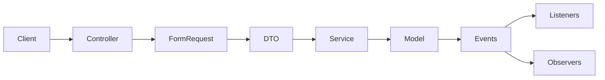

# SupportFlow

*[English version](README.md)*

SupportFlow: бэкенд ServiceDesk/хелпдеска на Laravel. Ведёт полный жизненный цикл тикета (создание, назначение, смена приоритета, комментарии, закрытие, переоткрытие), отслеживает дедлайны SLA по реакции и решению с автоматическим обнаружением нарушений, индексирует тикеты в Elasticsearch для полнотекстового поиска, и ведёт пофайловый журнал аудита изменений чувствительных записей. Поверх всего этого стоит админ-панель на Filament для тех, кто не хочет работать через API напрямую.

## Стек технологий

- **PHP 8.3+**, **Laravel 13**
- **PostgreSQL 15+** в качестве базы данных
- **Filament 5.9** для админ-панели
- **Elasticsearch 8.x** для поиска по тикетам
- **MinIO** (или любое S3-совместимое хранилище) для вложений тикетов
- **Laravel Sanctum** для аутентификации по токену
- **Spatie Laravel Permission** для ролей и прав
- **OpenAPI 3.0.3** для контракта API (`openapi.yaml`)
- **Pest** для тестирования, тесты работают с настоящей базой Postgres, а не с in-memory базой
- **Docker Compose** для локального Postgres, MinIO и Elasticsearch

## Ключевые инженерные решения

**Поиск никогда не обходит авторизацию.** Elasticsearch решает только, какие id тикетов подходят под запрос и в каком порядке. Реальный набор результатов всё равно проходит через `Ticket::visibleTo($user)`, тот же скоуп, что использует любой другой запрос к тикетам, применённый как фильтр на уровне базы данных уже после поиска в Elasticsearch. Устаревший или подделанный поисковый индекс может только сузить то, что видит пользователь, но никогда не расширить. Это покрыто отдельным тестом, который подсовывает фейковому поисковому клиенту id, на который у пользователя нет прав, и проверяет, что он не попадает в ответ.

**Недоступность Elasticsearch не кладёт работу с тикетами.** Индексация идёт через очередь, и джоб ловит собственные типы исключений Elasticsearch, пишет предупреждение в лог вместо падения запроса. Эндпоинт поиска делает то же самое, возвращая пустой результат вместо 500-й ошибки. Команда `tickets:reindex-search` доиндексирует всё, что было пропущено, пока Elasticsearch был недоступен.

**Журнал аудита: один Observer, а не пять.** `Ticket`, `TicketComment`, `TicketAttachment`, `User` и `SlaPolicy` подключают один и тот же трейт `HasAuditLog`, который регистрирует единый общий `AuditObserver` на каждой модели. Observer сравнивает через встроенные `getChanges()`/`getPrevious()` Eloquent вместо ручного сравнения полей, так что у каждой аудируемой модели одинаковая, протестированная логика диффа. Регистрация отложена через `whenBooted()` вместо прямого вызова из boot-метода трейта, это позволяет избежать исключения о повторном входе в boot модели в этой версии Laravel.

**Одна модель прав, применяется одинаково везде.** API работает через guard `sanctum`, Filament через `web`, и разрешение guard в Laravel может меняться посреди запроса в зависимости от того, какой middleware сработал последним. Модель `User` фиксирует свой Spatie guard явно, вместо того чтобы полагаться на значение по умолчанию, так что проверки ролей и прав работают одинаково независимо от того, через какой guard прошла аутентификация.

**Администраторы обходят любую Policy через один Gate, а чувствительные Policy запрещают доступ явно, а не по умолчанию через отсутствие метода.** `AppServiceProvider` даёт администраторам полный доступ через `Gate::before`. Policy, которые должны быть закрыты для всех остальных, как у журнала аудита, явно возвращают `false` из каждого метода, а не оставляют их нереализованными, чтобы не было неоднозначности насчёт того, что происходит по умолчанию, если метод Policy отсутствует.

## Структура проекта



- `app/Http/Controllers/Api`: контроллеры REST API, тонкие, делегируют работу сервисам
- `app/Http/Requests/Api`: FormRequest, валидация и авторизация для каждого эндпоинта
- `app/DataTransferObjects`: типизированные DTO, передаются из запросов в сервисы
- `app/Services`: бизнес-логика (операции с тикетами, расчёт SLA, поиск)
- `app/Models`: модели Eloquent
- `app/Events`, `app/Listeners`, `app/Observers`: доменные события и их побочные эффекты (уведомления, пересчёт SLA, индексация в поиске, аудит)
- `app/Policies`: правила авторизации, по одному на модель
- `app/Filament`: ресурсы, таблицы, формы и виджеты дашборда админ-панели
- `app/Jobs`: фоновая работа через очередь (сканирование вложений, индексация в поиске)
- `app/Console/Commands`: плановые и ручные artisan-команды
- `database/migrations`, `database/factories`, `database/seeders`
- `routes/api.php`: определения роутов API
- `tests/Feature`: весь набор тестов, уровня фич, с настоящей базой данных
- `openapi.yaml`: контракт API

## Как запустить

Приложению нужны запущенные Postgres, MinIO и Elasticsearch. `docker-compose.yml` в корне репозитория поднимает все три с теми же данными для подключения, что уже прописаны в `.env.example`:

```bash
docker compose up -d
composer install
cp .env.example .env
php artisan key:generate
php artisan migrate --seed
```

Сидер создаёт демо-роли, права, пул клиентов и тестовые тикеты, и сразу ставит их в очередь на индексацию в Elasticsearch. `test@example.com` / `password` заведён как администратор, так что этим пользователем можно сразу зайти и в API, и в админ-панель. Подробности смотрите в `database/seeders`.

### PostgreSQL

`.env.example` уже настроен на сервис `postgres` из `docker-compose.yml`:

```
DB_CONNECTION=pgsql
DB_HOST=127.0.0.1
DB_PORT=5432
DB_DATABASE=supportflow
DB_USERNAME=supportflow
DB_PASSWORD=supportflow-dev-secret
```

Этот контейнер при первом запуске также создаёт отдельную базу `supportflow_testing` (см. `docker/postgres/init-testing-db.sh`), на которую и смотрит `phpunit.xml`. Тесты работают с настоящей базой Postgres, а не с in-memory базой, так что перед запуском тестов `docker compose up -d postgres` тоже должен быть поднят.

### MinIO (вложения)

Вложения к тикетам хранятся в S3-совместимом бакете. `.env.example` уже настроен на сервис `minio` из `docker-compose.yml`. Сам бакет всё равно нужно создать один раз, уже после того как контейнер поднялся:

```bash
mc alias set supportflow-local http://localhost:9000 supportflow supportflow-dev-secret
mc mb supportflow-local/supportflow-attachments
```

Консоль MinIO будет доступна на `http://localhost:9001` (логин и пароль root-пользователя из `.env.example`).

### Elasticsearch (поиск)

Поиск по тикетам работает через Elasticsearch. `.env.example` уже настроен на сервис `elasticsearch` из `docker-compose.yml`. Индекс `tickets` создаётся автоматически при первой индексации тикета, отдельной миграции для этого не нужно. Если Elasticsearch недоступен, создание/изменение/удаление тикетов всё равно работает, а поиск просто ничего не находит вместо того чтобы падать (см. «Ключевые инженерные решения» выше). Когда Elasticsearch снова доступен, выполните `php artisan tickets:reindex-search`, чтобы доиндексировать то, что было пропущено во время простоя.

## Переменные окружения и секреты

Ничего из этого не настоящие секреты, это локальные дев-значения по умолчанию, совпадающие с `.env.example` и `docker-compose.yml`. Для реального деплоя замените каждое значение.

| Переменная | Назначение |
|---|---|
| `DB_*` | Подключение к Postgres (хост, порт, база, пользователь, пароль) |
| `AWS_ACCESS_KEY_ID`, `AWS_SECRET_ACCESS_KEY` | Учётные данные MinIO/S3 для хранения вложений |
| `AWS_BUCKET`, `AWS_ENDPOINT` | В каком бакете и по какому адресу хранить вложения |
| `ELASTICSEARCH_HOSTS` | URL узла(ов) Elasticsearch |
| `ELASTICSEARCH_TICKET_INDEX` | Имя индекса для документов тикетов |
| `APP_KEY` | Ключ шифрования Laravel, сгенерируйте свой через `php artisan key:generate` |

## Документация API

Все эндпоинты живут под `/api/v1` и, кроме выдачи токена, требуют заголовок `Authorization: Bearer <token>`. Полный контракт, все эндпоинты, форматы запросов и ответов, формат ошибок: всё это описано в [`openapi.yaml`](openapi.yaml). Откройте его в [Swagger Editor](https://editor.swagger.io/) или любом другом просмотрщике OpenAPI.

Группы ресурсов:

- `tickets`: CRUD, плюс действия `assign`/`close`/`reopen`/`priority` и эндпоинт поиска (`GET /tickets/search?q=...`)
- `tickets/{ticket}/comments`, `tickets/{ticket}/attachments`, `tickets/{ticket}/watchers`, `tickets/{ticket}/tags`
- `saved-filters`: сохранённые фильтры списка тикетов для конкретного пользователя
- `departments`, `teams`, `ticket-categories`, `tags`, `sla-policies`: справочники, которыми управляют администраторы

Авторизуйтесь по email и паролю, чтобы получить токен, а затем передавайте его как bearer-токен:

```bash
curl -X POST http://localhost:8000/api/v1/auth/tokens \
  -H "Content-Type: application/json" \
  -H "Accept: application/json" \
  -d '{"email": "test@example.com", "password": "password"}'
# => { "data": { "token": "1|xxxxxxxxxxxxxxxxxxxxxxxxxxxxxxxxxxxxxxxx" } }

curl http://localhost:8000/api/v1/tickets \
  -H "Authorization: Bearer 1|xxxxxxxxxxxxxxxxxxxxxxxxxxxxxxxxxxxxxxxx" \
  -H "Accept: application/json"
```

Текущий токен отзывается через `DELETE /api/v1/auth/tokens/current`.

## Миграции базы данных

```bash
php artisan migrate
```

Свежая установка: `php artisan migrate --seed` (см. «Как запустить» выше). Чтобы откатить и пересоздать с нуля: `php artisan migrate:fresh --seed`.

## Тесты

Нужен запущенный контейнер Postgres (`docker compose up -d postgres`), поскольку тесты работают с настоящей базой `supportflow_testing`, а не с in-memory базой.

```bash
php artisan test
# или
vendor/bin/pest
```

Тесты повсюду уровня фич: настоящая база данных, настоящие фабрики, никакой бизнес-логики через моки. Единственное место, где появляется тестовый дублёр: граница клиента Elasticsearch, для теста, который отдельно проверяет, что устаревший результат поиска отфильтровывается авторизацией (см. «Ключевые инженерные решения» выше).

## Демо

Нигде не задеплоено. Это портфолио-проект, рассчитанный на запуск локально по инструкции «Как запустить» выше; сидер сразу даёт заполненную базу (40 тикетов, агенты, клиенты, категории) для изучения.

## Ограничения

- Журнал аудита записывает только события `updated`, не `created` и не `deleted`, и только для `Ticket`, `TicketComment`, `TicketAttachment`, `User` и `SlaPolicy`. Изменения связей many-to-many не отслеживаются (добавление тега или наблюдателя к тикету не вызывает событие `updated` самого тикета). Политики хранения или очистки старых записей нет, строки накапливаются бесконечно.
- Доступ к журналу аудита только у администраторов через обход `Gate::before`, отдельного гранулярного права для этого нет.
- Поиск через Elasticsearch ограничен 50 результатами и не постраничный.
- Нет пайплайна CI/CD для деплоя, репозиторий рассчитан на клонирование и локальный запуск.

## Лицензия

MIT, согласно `composer.json`.
